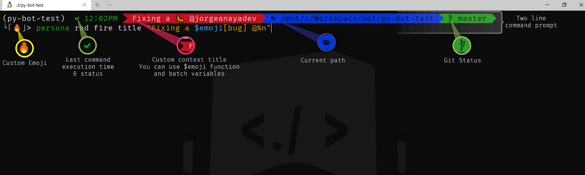
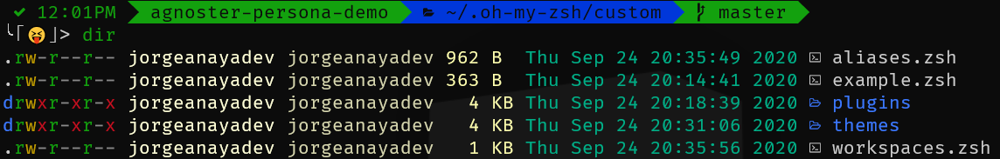

<div align="center" id="top"> 
  

  &#xa0;

  <!-- <a href="https://3251958dc0a0952df586493b345fd4ab.netlify.app">Demo</a> -->
</div>

<h1 align="center">Agnoster Persona</h1>

<p align="center">
  

  

  

  

  <!--  -->

  <!--  -->

  <!--  -->
</p>

<!-- Status -->

<!-- <h4 align="center"> 
	🚧  3251958dc0a0952df586493b345fd4ab 🚀 Under construction...  🚧
</h4> 

<hr> -->

<p align="center">
  <a href="#dart-about">About</a> &#xa0; | &#xa0; 
  <a href="#sparkles-features">Features</a> &#xa0; | &#xa0;
  <a href="#rocket-technologies">Technologies</a> &#xa0; | &#xa0;
  <a href="#white_check_mark-requirements">Requirements</a> &#xa0; | &#xa0;
  <a href="#checkered_flag-starting">Starting</a> &#xa0; | &#xa0;
  <a href="#memo-license">License</a> &#xa0; | &#xa0;
  <a href="https://github.com/jorgeanayadev/" target="_blank">Author</a>
</p>

<br>

## :dart: About ##

**AGNOSTER PERSONA**

The idea behind this modification is to add "personality" to command line, sometimes you're working with several tabs and this customization allows to quickly identify which one is the one you're looking for and have fun in the process. 

## :sparkles: Features ##



:heavy_check_mark: Two line command prompt means more space for title, current path, git status, pyvenv  \
:heavy_check_mark: Includes last command status and time of execution\
:heavy_check_mark: Change context title and color \
:heavy_check_mark: Change emoji in command prompt \
:heavy_check_mark: Based on Agnoster so it includes git status, pyvenv, nodejs, aws

## :rocket: Technologies ##

The following tools were used in this project:

- [oh my zsh](https://ohmyz.sh/)
- [emoji plugin](https://github.com/ohmyzsh/ohmyzsh/tree/master/plugins/emoji)
- [powerline fonts](https://github.com/powerline/fonts)
- Based on [agnoster theme](https://gist.github.com/agnoster/3712874)

## :white_check_mark: Requirements ##

Before starting :checkered_flag: 

1. Install [oh my zsh](https://ohmyz.sh/) in your environment.
2. Download and Install [powerline fonts](https://github.com/powerline/fonts).
3. [Configure your terminal](https://gist.github.com/agnoster/3712874#compatibility) to use powerline fonts.
4. Download [agnoster-persona.zsh-theme](https://github.com/jorgeanayadev/agnoster-persona/blob/master/agnoster-persona.zsh-theme) to your .oh-my-zsh/custom/theme folder
5. Change the theme and enable emoji plug-in 
```bash 
# edit your .zshrc config file
nano ~/.zshrc

# find theme config and change it
ZSH_THEME="agnoster-persona"

# find plugin config and add emoji plugin
plugins=(git emoji)
```

*Tested on Mac OS 15, Ubuntu 20.04, and Windows 10 WSL2*
## :zap: Usage ##

Syntax examples: 

**List the available icons**
```bash
# The group is optional
$> persona list [animals|faces|fruits|vehicles]
```

**Pick a custom color and let persona assing a random emoji**
```bash
# Available colors: black|white|red|green|blue|yellow|magenta
# The random emoji will be selected from EMOJI variable
$> persona [color_name]
```
> You can set up your random icons in the [EMOJIS variable](
https://github.com/jorgeanayadev/agnoster-persona/blob/1e9baaa8e832d4dc2a302f8f5e1d05d4cae2a153/agnoster-persona.zsh-theme#L42)

**Pick a custom color and set your emoji**
```bash
$> persona [color_name] [emoji_name]
```
> Some emoji names are so long, you can set up a custom shortcut in the [emoji_fav() function](https://github.com/jorgeanayadev/agnoster-persona/blob/1e9baaa8e832d4dc2a302f8f5e1d05d4cae2a153/agnoster-persona.zsh-theme#L332). Just add another case entry:
```bash
#   (<your_shortcut_name>) echo '<full_emoji_name>' ;;
    (lol) echo 'face_with_stuck_out_tongue_and_tightly_closed_eyes' ;;    
```

**Pick a custom color, set your emoji and your title**
```bash
$> persona [color_name] [emoji_name] title [your_msg_title]
```

**You can set your title only (if you've already set a color and emoji previously)**
```bash
$> persona title [your_msg_title]
```

## :heart::green_heart::blue_heart: Colorful console  ##

My day to day setup includes the following: 
- [Agnoster Persona](https://github.com/jorgeanayadev/agnoster-persona)
- [LSD](https://github.com/Peltoche/lsd) adds color to your ls commands
- oh my zsh plugins ```plugins=(git emoji zsh-autosuggestions zsh-syntax-highlighting)```
  - [emoji](https://github.com/ohmyzsh/ohmyzsh/tree/master/plugins/emoji)
  - [zsh-autosuggestions](https://github.com/zsh-users/zsh-autosuggestions)
  - [zsh-syntax-highlighiting](https://github.com/zsh-users/zsh-syntax-highlighting)

## :memo: License ##

This project is under license from MIT.


Made with :heart::egg::fire: by <a href="https://github.com/jorgeanayadev/" target="_blank">Jorge Anaya </a>

&#xa0;

<a href="#top">Back to top</a>
